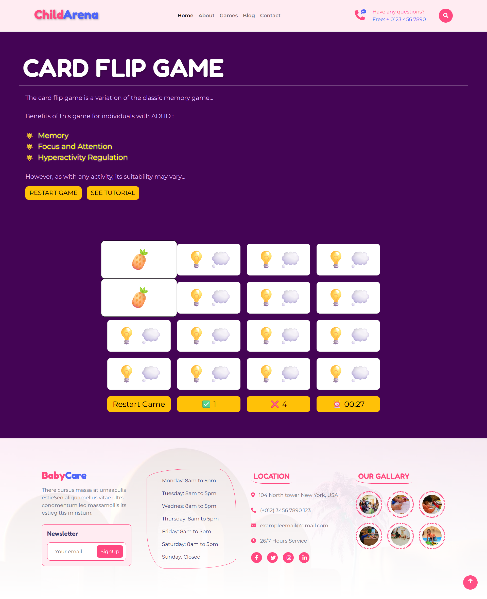
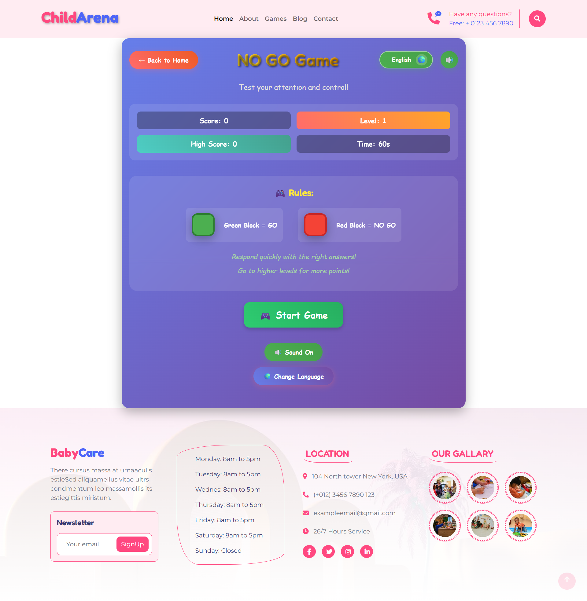

# 🧠 INTERACTIVE	PLATFORM	FOR DETECTION	OF	ADHD	TRAITS IN	CHILDREN	THROUGH GAMIFIED	ACTIVITIES : ADHD Diagnostic Tool


> **Bridging the gap between clinical psychology and interactive technology.**

## 📖 Project Overview

Our project is a research based software solution designed to screen for Attention Deficit Hyperactivity Disorder (ADHD) using gamification techniques. Unlike traditional paper based questionnaires, this tool utilizes interactive gameplay to measure attention span, impulsivity, and reaction times in a stress free environment.

This project was developed as a comprehensive research initiative to determine if gamified metrics can correlate with standard DSM-5 diagnostic criteria.

---

## ✨ Key Features

### 🎮 Gamified Assessment
* **Interactive Modules:** Mini games designed to test sustained attention and working memory.
* **NO-GO Game:** Measures impulse control and inhibition with real-time emotion tracking
* **Visual Feedback:** Engaging UI to keep users focused during the assessment.
* **Impulsivity Tracking:** Measures premature clicks and reaction variability.
* **Multi-Language Support:** Available in English, Sinhala, and Tamil

### 📊 Diagnostic Analytics
* **Real-time Scoring:** Instant calculation of performance metrics.
* **Comparative Analysis:** Compare user results against control group baselines.
* **Detailed Reports:** Generates PDF reports for clinicians or parents.
* **Detailed CSV Reports:** Comprehensive data export including emotion and motor metrics
* **Impulsivity Scoring:** Calculates inhibition success rates and response variability

### 🛡️ User Management
* **Role Based Access:** Separate dashboard for parents.
* **Secure Data:** Anonymized data storage for research integrity.
* **JWT Authentication:** Secure login for Users.
* **NoSQL Data Structure:** Flexible schema for storing complex gameplay logs.

### ⚠️ Attention Detection 
- 🎮 Interactive fish ball collector game 
- 👁️ Real-time eye tracking using webcam (MediaPipe FaceMesh)
- 📊 Game performance tracking (score, reaction time, ball collection)
- 💾 Data storage in MongoDB Atlas
- 🤖 ML model for attention pattern analysis

---

## 🛠️ Technology Stack

| Category | Technologies Used |
| :--- | :--- |
| **Frontend** | React.js, Redux (State Management), Tailwind CSS / Material UI, Phaser.js |
| **Backend** | Node.js, Express.js |
| **Database** | MongoDB Atlas |
| **Authentication** | JSON Web Tokens (JWT) |
| **Model Training** | Python |
---

## 🔬 Research Methodology

This tool operates on a specific set of psychological parameters:

1.  **Sustained Attention:** Measured by the user's ability to track targets over time.
2.  **Response Inhibition:** Measured by NO-GO success rates and stop-signal delays
3.  **Emotional Regulation:** Quantified via facial expression changes during tasks
4.  **Motor Control:** Analyzed through micro-movements and response precision
5.  **DSM-5 Integration:** Game results are cross referenced with digital questionnaire inputs.

---

## 👥 The Research Team

This project is brought to you by a dedicated team of four:

| Name | Contribution |
| :--- | :--- |
| **IT22258694 Vidurangi K.G.D** | FishBall game, Eye tracking, Attention model |
| **IT22349460 Warunika R S** | Built a NO-GO game that tracks facial expressions and motor movements to assess impulse control.|
| **IT22582492 R SETHMINA UDANA** | Made card flip game to capture child's memory behaviour via reaction time |
| **IT22141538 Arunodya	Pathum	Miyuranga W.A.K.** |Build parent dashboard with ADHD analysis |

---

## 🚀 Installation & Setup

Follow these steps to set up the project locally:

### Prerequisites
* Node.js (v14 or higher)
* MongoDB (Atlas URL)
* [Git](https://git-scm.com/)
  
1.  **Clone the repository**
    ```bash
    git clone https://github.com/sethminaudana/kids-gaming-platform.git
    ```

2.  **Backend Setup (Server)**
    * cd server.
    * npm install.
    * npm start.

3.  **Frontend Setup (Client)**
    * cd client.
    * npm install.
    * npm run dev.


---

## 📸 Screenshots


| Section | Preview |
| :---: | :---: |
| **Landing Page** |  |
| **Game Pages** |  <br>  |
---

## 📝 Future Scope

* AI Analysis: implementing a Python microservice to analyze gameplay patterns.
* Expansion: Adding more modules for other neurodivergent conditions.

---


